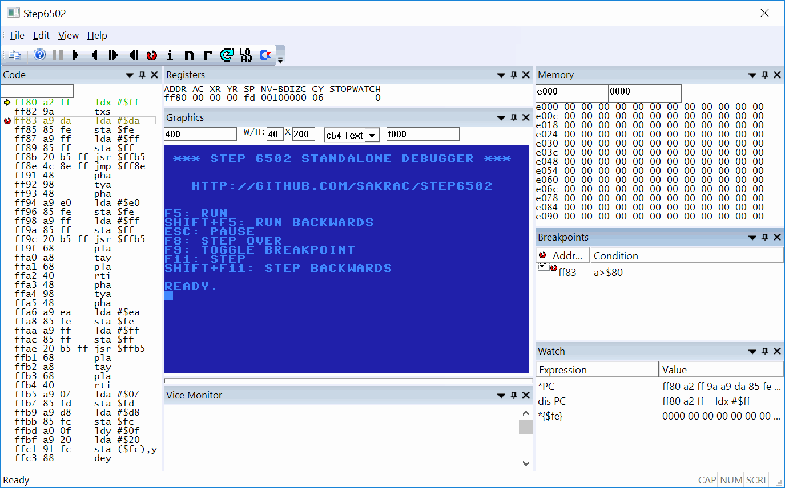

#Step6502 Documentation

Step6502 is a stand-alone 6502 windowed debugger similar to visual studio. The debugger is not associated with any particular computer and does not emulate peripheral components such as a display or a keyboard. The emulation code is based on the design of http://www.gianlucaghettini.net/mos-6502-cpu-emulator-in-c/

Since the 6502 CPU context is just 8 bytes it is simple to store a complete machine delta for each instruction, which allows for an effective per instruction undo buffer. The undo buffer is used to step and run backwards in time, which fits nearly 2 million instructions or about two full seconds of 1 MHz running.

##Background

This debugger is simply a fun project, Tinkering with 6502 assembler I've got too comfortable with modern GUI debuggers such as Microsoft Visual Studio and SN Systems debuggers.

If you're looking for a 6502 series command line assembler try this one: https://github.com/sakrac/x65.

##Download

Ready-to-play binaries can be downloaded from:

* [Windows x64](../..//raw/master/bin/Step6502-x64.zip)
* [Windows x86](../..//raw/master/bin/Step6502-x86.zip)

##Instructions

All address text fields are in hexadecimal, other text fields are in decimal.

To adjust the font size go to the View menu.

To load a binary file to memory use the LOAD toolbar button, which opens up a file dialog and then a load address dialog box to select how to load the file into memory. To reload a binary file with the same options click on the reload toolbar button (the circular arrow icon).

If there is a vice monitor command file with the same name as the binary with the extension ".vs" symbols and breakpoints will be loaded with the binary file, if the ".vs" can not be found a file with the extension ".sym" will be loaded.

###Toolbar

The buttons on the toolbar can control most of the functions of the Code View.

* Copy: Not implemented yet
* Help: Brings up the About dialog
* Pause: This button is enabled when the CPU is running
* Run: Run the emulator
* Run backwards: Undo instructions until paused, a breakpoint is hit or the undo buffer is empty.
* Step: Step one instruction
* Step backwards: Undo a single instruction
* Breakpoint: If a line of code is marked in the code view, set a breakpoint on that line
* Interrupt: Issue an IRQ
* NMI: Issue a non maskable interrupt
* Reset: Signal a reset, sets the PC to the reset vector address
* Reload: Load the previously loaded binary with the previous options, even if the debugger has been reopened since
* Load: Load a binary into RAM

###Code View

Keyboard:

* **F11**: Step forward
* **SHIFT + F11**: Step backward
* **F8**: Step over (forward)
* **F5**: Run
* **SHIFT+F5**: Run backward
* **TAB**: Go to PC
* **SHIFT+TAB**: Set PC to cursor

Left mouse button click selects a line in the current code view.

Double click a line in the current code view to edit the instruction at that address.

The CodeView pane accepts drag & drop of binary files.

The toolbar can be used to control code as well.

###Memory View

Enter address in the left edit box, and number of columns in the right edit box. 0 columns makes the number of columns fit the pane width.

Use arrow up/down and page up/down to move the address.

Click on a byte in the display to edit memory, move the cursor while editing with the arrow keys.

###Register View

Click on the fields to change them..

###Graphic View

There are five different display modes, currently based on common C64 graphics modes. For text mode a font is included at address $f000.

The width of the graphic view is in bytes, or sets of 8 to represent the memory layout.

By default the Graphic View scales the image to the available space, double click on the image to set fixed scales (fit -> 1x -> 2x -> 4x -> fit)

If the image is larger than the pane it can be moved by dragging with the left mouse button.

###Loading a binary file

When loading a binary executable or drag & dropping one into the code view a "Load Address" dialog box will ask how to load it.

* C64 PRG is a binary file preceeded by two bytes of loading address, the debugger will read out the address and put the file there.
* Apple II Dos 3.3 files are preceeded by a load address and a load size.
* Binary are pure binary files and the Address from the next line in Load Options will be used.
* Force Address overrides the file address of C64 PRG and Apple II Dos 3.3.
* The address file is used for loading pure binary files.
* Set PC to load address forces the program counter to the address the file was loaded at.
* Reset backtrace buffer removes all undo buffer instructions so that running backwards won't run past the start of the new executable.

###Boot RAM autoload

In order to debug code reliant on an operating system or similar Step6502 will attempt to load a file named "bootram.bin" from the same
folder as the Step6502 executable at startup into the 6502 RAM. The file will be loaded at address 0 and should fill the entire 64 kb.

If the file size is 64kb + 2 bytes the first two bytes will be skipped (C64 PRG file).

If the file is not found there is a minimal program that accepts RESET, IRQ and NMI.

To generate a "bootram.bin" file using vice go to the File menu and select Attach Disk Image to device 8, select an appropriate folder
and then type a filename with the extension .d64 into the File Name field. First hit Create Image and then Attach Image.

Now open the monitor by pressing Alt+m and type: s "bootram.bin" 8 0 ffff

Exit vice, open a command line prompt and go to the folder with the .d64 and run vice\c1541.exe <name>.d64 and type "extract" followed by "quit".

##Building the debugger project

The project was built using Microsoft Visual Studio 2015 Community Edition with C++ and MFC installed, which can be downloaded from:

https://www.visualstudio.com/en-us/downloads/download-visual-studio-vs.aspx
